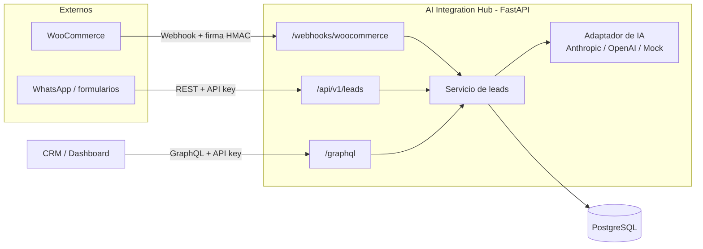

# AI Integration Hub

[](https://github.com/jliceav/ai-integration-hub/actions/workflows/ci.yml)

Servicio de integración que **recibe prospectos y pedidos de sistemas externos** (WooCommerce, WhatsApp, formularios web), **los analiza con IA** (intención, prioridad, idioma y resumen) y **los expone a sistemas internos** (CRM, dashboards, ERP) por **REST** y **GraphQL**.

Nació de un caso real en turismo: un negocio que vende reservas de Day Pass por web y WhatsApp necesita saber qué mensajes son reservas urgentes, cuáles son quejas y cuáles solo piden precios, sin que alguien los lea uno por uno.

**Stack:** Python 3.12 · FastAPI · Strawberry GraphQL · SQLAlchemy 2 · PostgreSQL · Docker · GitHub Actions · Azure (Container Apps, API Management, PostgreSQL)

## Arquitectura



## Qué demuestra este proyecto

| Requisito | Dónde está |
|---|---|
| Integrar APIs de IA | `app/ai/client.py`: adaptador con 3 proveedores intercambiables, respuesta JSON validada, reintentos y respaldo si la IA falla |
| Conectar sistemas internos y externos | `app/routers/webhooks.py` (WooCommerce entra) y `app/routers/leads.py` + `app/graphql_api.py` (CRM consume) |
| Diseñar servicios de integración | Capas separadas: routers → servicio → modelos; idempotencia y mapeo de datos |
| Seguridad y disponibilidad | API key, firma HMAC de webhooks, contenedor sin root, `/health`, reintentos con backoff, pool con `pre_ping` |
| Documentación | OpenAPI automática en `/docs`, este README, `docs/decisiones-tecnicas.md` |
| Docker / Azure / SQL | `Dockerfile`, `docker-compose.yml`, `deploy/azure/`, SQLAlchemy + PostgreSQL |

## Cómo correrlo

### Opción A: Docker (recomendada)

```bash
cp .env.example .env
docker compose up --build
```

Abre http://localhost:8000/docs

### Opción B: Python local (SQLite)

```bash
python -m venv .venv && source .venv/bin/activate   # Windows: .venv\Scripts\activate
pip install -r requirements-dev.txt
cp .env.example .env
uvicorn app.main:app --reload
```

### Pruebas

```bash
pytest -q
```

Las 15 pruebas cubren: autenticación, validación, idempotencia, firma de webhooks, GraphQL, reintentos y respaldo de la IA.

## Ejemplos

**Crear un lead (REST):**

```bash
curl -X POST http://localhost:8000/api/v1/leads \
  -H "X-API-Key: cambia-esta-llave" -H "Content-Type: application/json" \
  -d '{"source":"whatsapp","external_id":"wa-1","customer_name":"Ana","message":"Quiero reservar el Day Pass para 4 personas el sábado"}'
```

Respuesta (resumida):

```json
{"id": 1, "intent": "booking", "priority": "high", "language": "es", "status": "new"}
```

**Filtrar:** `GET /api/v1/leads?intent=booking&priority=high`

**Cambiar estatus:** `PATCH /api/v1/leads/1` con `{"status": "won"}`

**GraphQL** (en http://localhost:8000/graphql):

```graphql
query { leads(priority: "high") { id customerName intent summary } }

mutation { updateLeadStatus(id: 1, status: "contacted") { id status } }
```

**Webhook de WooCommerce:** en WooCommerce → Ajustes → Avanzado → Webhooks, crea uno con tema *Pedido creado*, URL `https://TU-DOMINIO/webhooks/woocommerce` y el mismo secreto que `WOOCOMMERCE_WEBHOOK_SECRET`.

## Usar IA real

En `.env`:

```
AI_PROVIDER=anthropic      # o openai
AI_API_KEY=tu-llave
AI_MODEL=                  # opcional; revisa el modelo vigente en la documentación del proveedor
```

Con `AI_PROVIDER=mock` se usa un clasificador por reglas: sirve para desarrollar y probar sin costo.

## Despliegue en Azure

Ver [`deploy/azure/README.md`](deploy/azure/README.md).

## Estructura

```
app/
  main.py            # arranque, middleware de request-id, /health
  config.py          # configuración por variables de entorno
  db.py, models.py   # SQLAlchemy y tabla leads
  schemas.py         # contratos de entrada y salida (Pydantic)
  security.py        # API key y firma HMAC
  ai/client.py       # integración con APIs de IA
  services/leads.py  # lógica de negocio
  routers/           # REST y webhooks
  graphql_api.py     # GraphQL
tests/               # pytest
deploy/azure/        # script y guía de despliegue
```

## Autor

**Juan Licea**: Ingeniero en Computación · [LinkedIn](https://www.linkedin.com/in/juan-licea/) · [GitHub](https://github.com/jliceav)
