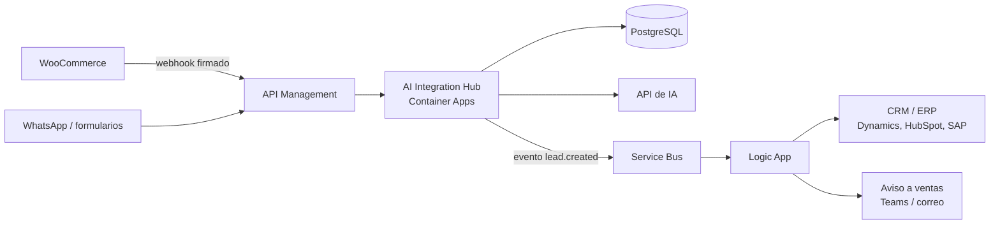

# Despliegue en Azure

`deploy.sh` crea todo el entorno con Azure CLI en unos 15 minutos.

```bash
az login
AI_PROVIDER=mock bash deploy/azure/deploy.sh
```

## Qué servicio de Azure hace qué

| Pieza | Servicio de Azure | Para qué sirve |
|---|---|---|
| Imagen Docker | **Azure Container Registry** | Guarda la imagen. `az acr build` la construye en la nube. |
| API | **Azure Container Apps** | Corre el contenedor con HTTPS, health checks y escalado automático (1 a 3 réplicas). |
| Base de datos | **Azure Database for PostgreSQL** | PostgreSQL administrado, con respaldos automáticos y SSL obligatorio. |
| Secretos | **Secretos de Container Apps** (o Key Vault en producción) | Las llaves nunca quedan en el código ni en la imagen. |
| Puerta de entrada | **API Management** *(Azure Integration Services)* | Llaves por cliente, límites de uso, versionado y analítica, sin tocar el código. |

## Cómo encaja con Azure Integration Services

Azure Integration Services son cuatro servicios: **API Management, Logic Apps, Service Bus y Event Grid**. Este proyecto usa API Management. Así se escalaría el mismo diseño:



- **Service Bus**: cola de mensajes. Si el CRM está caído, los eventos esperan en la cola y no se pierden.
- **Logic Apps**: flujos visuales con conectores listos (Dynamics 365, Salesforce, SAP, Teams, Outlook). Evitan escribir código para cada sistema.
- **Event Grid**: reparte eventos a varios suscriptores ("llegó un lead de alta prioridad").

## Borrar todo al terminar

```bash
az group delete -n rg-ai-integration-hub --yes
```
